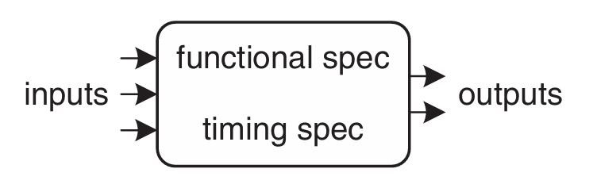
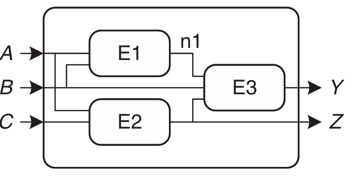
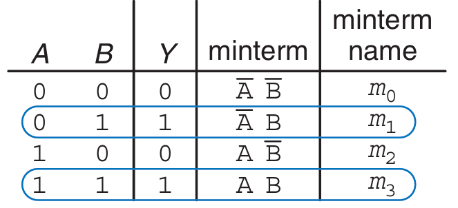
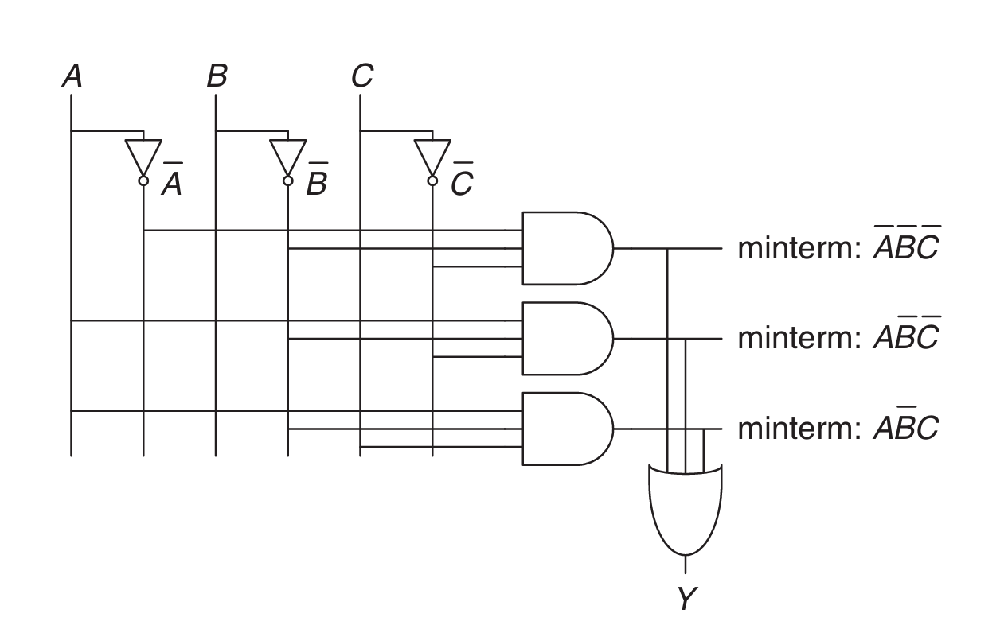

# 组合逻辑电路

**电路**是一个处理离散值变量的网络，可以将其看作一个具有：

-   一个或多个离散值**输入端**
-   一个或多个离散值**输出端**
-   描述输入与输出之间关系的**功能规格(functional specification)**
-   描述输入变化与输出响应之间延迟的**时序规格(timing specification)**

的黑盒(如下图)

{align=right}

而在黑盒的内部，电路由**节点(nodes)**和**元件(elements)**组合而成.

-   元件是一个有输入,输出和规格的电路
-   节点则相当于导线

!!! note "节点的分类"
    节点可以分为输入节点,输出节点以及内部节点

    

    如上图,$A$,$B$和$C$是输入节点,$Y$和$Z$是输出节点,$n1$是内部节点

电路可以分为**组合电路**和[**时序电路**](./chapter3.md),组合电路的输出只取决于当前的输入

组合电路的功能规格描述了输出值与输入值之间的关系,常使用真值表或布尔方程表示,而它的时序规格则规定了从输入到输出的过程中，信号延迟的最大值和最小值

在设计组合逻辑设计时,应该遵守以下规则

-   每个电路元件本身都是组合逻辑电路
-   电路中的每个节点要么被指定为电路的输入端，要么与某个电路元件的唯一一个输出端相连
-   该电路中没有循环路径：每条路径在遍历电路时，每个节点最多被访问一次

!!! tip ""
    组合逻辑的构成规则是充分但不必要条件。只要输出仅取决于当前的输入，即使不满足上述规则，仍然属于组合逻辑电路。

## 布尔方程

**布尔方程**所处理的变量只有“真”(True)或“假”(False)两种值，因此非常适合用来描述数字逻辑

### 术语

A的补记作$\overline{A}$,表示将$A$取反.变量或者它的补称为**字面量**.

一个或多个字面量的AND称为**积**或者**蕴含项**,一个或多个字面量的OR称为**和**

**小项**是指包含函数中所有输入变量的乘积,**大项**则是指包含函数中所有输入变量的和   

### Sum-of-Products(SOP)

具有$N$个输入的真值表包含$2^N$行，每行对应输入的某一种可能取值。真值表的每一行都对应着一个小项.当该行的真值为真时，对应的最小项也为真.这些小项从上至下依次记为$m_0,m_1,\cdots$

可以将所有使输出Y为“真”的小项相加，得到相应的SOP

如图,$Y=\overline{A}B+AB$,也可以使用$\Sigma$符号写为
$$
F(A, B)=\Sigma(m_1, m_3)\quad\text{或}\quad F(A, B)=\Sigma(1, 3)
$$

### Product-of-Sums(POS)

表示布尔函数的另一种方法是POS.

真值表中的每一行对应着一个大项，而当该行为假时，对应的最大项也为假.对于的POS方程就是所有输出为假的那些大项的AND运算结果

如图,$Y=(A+B)(\overline{A}+B)$,也可以使用$\Pi$符号写为
$$
F(A, B)=\Pi(M_0, M_2)\quad\text{或}\quad F(A, B)=\Pi(0, 2)
$$

## 布尔代数

布尔代数的定律和定理可以通过真值表验证,也可以通过代数证明.下面是一些常用的定律和定理

| Axiom               | Dual             | Name         |
| ------------------- | ---------------- | ------------ |
| $B=0$ if $B\ne1$    | $B=1$ if $B\ne0$ | Binary filed |
| $\bar{0}=1$         | $\bar{1}=0$      | NOT          |
| $0\cdot0=0$         | $1+1=1$          | AND/OR       |
| $1\cdot1=1$         | $0+0=0$          | AND/OR       |
| $0\cdot1=1\cdot0=0$ | $0+1=1+0=1$      | AND/OR       |

下面这5条定理是关于单命题的

| Theorem                     | Dual               | Name         |
| --------------------------- | ------------------ | ------------ |
| $B\cdot1=B$                 | $B+0=B$            | Identity     |
| $B\cdot0=0$                 | $B+1=1$            | Null element |
| $B\cdot B=B$                | $B+B=B$            | Idempotency  |
| $\overline{\overline{B}}=B$ |                    | Involution   |
| $B\cdot\overline{B}=0$      | $B+\overline{B}=1$ | Complements  |

下面这7条定理是关于多命题的

| theorem                                                      | dual                                                         | Name                |
| ------------------------------------------------------------ | ------------------------------------------------------------ | ------------------- |
| $B \cdot C = C \cdot B$                                      | $B + C = C + B$                                              | Commutativity       |
| $(B \cdot C) \cdot D = B \cdot (C \cdot D)$                  | $(B + C) + D = B + (C + D)$                                  | Associativity       |
| $(B \cdot C) + (B \cdot D) = B \cdot (C + D)$                | $(B + C) \cdot (B + D) = B + (C \cdot D)$                    | Distributivity      |
| $B \cdot (B + C) = B$                                        | $B + (B \cdot C) = B$                                        | Covering            |
| $(B \cdot C) + (B \cdot \overline{C}) = B$                   | $(B + C) \cdot (B + \overline{C}) = B$                       | Combining           |
| $(B \cdot C) + (\overline{B} \cdot D) + (C \cdot D)$ $= (B \cdot C) + (\overline{B} \cdot D)$ | $(B + C) \cdot (\overline{B} + D) \cdot (C + D)$ $= (B + C) \cdot (\overline{B} + D)$ | Consensus           |
| $\overline{B_0 \cdot B_1 \cdot B_2 \cdots}$ $= (\overline{B_0} + \overline{B_1} + \overline{B_2} \cdots)$ | $\overline{B_0 + B_1 + B_2 \cdots}$ $= (\overline{B_0} \cdot \overline{B_1} \cdot \overline{B_2} \cdots)$ | De Morgan’s Theorem |

## 从逻辑到逻辑门

我们可以使用**示意图(schematic)**来展示数字电路的元件以及连接它们的导线

!!! example "一个例子"
    画出下面这个方程的示意图
    $$
    Y=\bar{A}\bar{B}\bar{C}+A\bar{B}\bar{C}+A\bar{B}C
    $$

    

在画示意图时,为了方便阅读与调试,做出以下约定:

- Inputs are on the left (or top) side of a schematic.
- Outputs are on the right (or bottom) side of a schematic.
- Whenever possible, gates should flow from left to right.
- Straight wires are better to use than wires with multiple corners (jagged wires waste mental effort following the wire rather than thinking about what the circuit does).
- Wires always connect at a T junction.
- A dot where wires cross indicates a connection between the wires.
- Wires crossing without a dot make no connection.