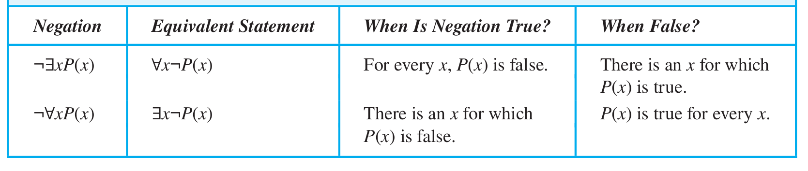

## 谓词

涉及$n$个变量 $x_1,x_2,\cdots,x_n$ 如的语句可以表示成,

$$
P(x_1,x_2,\cdots,x_n)
$$

形式为 $P(x_1,x_2,\cdots,x_n)$ 的语句是命题函数 $P$ 在"$n$元组 $(x_1,x_2,\cdots,x_n)$ 的值，$P$ 也称为“ $n$ 位谓词"或"$n$元谓词".

>描述合法输入的语句叫做 **前置条件**，而程序运行的输出应该满足的条件称为 **后置条件**.

## 量词

>处理谓词和量词的逻辑领域称为 **谓词演算**。
>
>许多数学命题断言某一性质对于变量在某一特定域内的所有值均为真，这一特 定域称为变量的 **论域**(或 **全体域**)时常简称为 **域**.

#### 全称量词
**定义1**$\qquad$$P(x)$的全称量化是语句

$$
P(x)对在其论域的所有值为真.
$$

符号$\forall xP(x)$表示$P(x)$的全称量化,其中$\forall$称为 **全称量词**。命题 $\forall xP(x)$ 读做“对所有$x$,$P(x)$”或“对每个$x$,$P(x)$”.
一个使$P(x)$为假的个体称为$\forall xP(x)$的反例.

#### 存在量词

**定义2**$\qquad$$P(x)$的存在量化是语句

$$
论域中存在一个x满足P(x)
$$

符号$\exists xP(x)$表示$P(x)$的全称量化,其中$\exists$称为 **存在量词**.

!!! note 存在量词的其他表示方法
    “对某些”,“至少有一个”或“有”;
    存在量词可读做 “有一个$x$满足$P(x)$” “至少有一个$x$满足$P(x)$” 或 “对某个$x$，$P(x)$".

全称量词和存在量词可以用如下的方式进行表示

$$\begin{aligned}
\forall P(x)&\equiv P(x_1)\wedge P(x_2)\wedge\cdots\wedge P(x_n)\\
\exists P(x)&\equiv P(x_1)\vee P(x_2)\vee\cdots\vee P(x_n)
\end{aligned}$$

!!!question "如果$P(x)$是语句“$x>10$”，论域为不超过4的正整数，则$\exists P(x)$的真值是什么?"
    **解:**
    论域为$\{1,2,3,4\}$,则

    $$
    \exists P(x)\equiv P(1)\vee P(2)\vee P(3)\vee P(4)
    $$

    因为$P(4)=4^2>10$,所以$\exists P(x)$为假.

#### 唯一性量词

用符号$\exists!$或$\exists_1$表示唯一性量词,这种表示法是指“存在一个唯一的$x$使得$P(x)$为真”。

#### 优先级

量词$\forall$和$\exists$比命题演算中的所有逻辑运算符都具有更高的优先级.

>$\forall P(x)\vee Q(x)$表示$(\forall P(x))\vee Q(x)$而不是$\forall (P(x)\vee Q(x))$.

#### 变量绑定
当量词作用于变量$x$时，我们说此变量的这次出现为**约束的**。
一个变量如果没有被量词约束或设置为等于某一特定值,则它的出现被称为是**自由的**.

>命题函数中的所有变量出现必须是约束的或者被设置为等于某个特定值的，才能把它转变为一个命题。

## 涉及量词的逻辑等价式
**定义3**$\qquad$涉及谓词和量词的语句是逻辑等价的当且仅当无论用什么谓词代入这些语句,也无论为这些命题函数里的变量指定什么论域,它们都有相同的真值.我们用$S\equiv T$表示涉及谓词和量词的两个语句$S$和$T$是逻辑等价的.

$$\begin{aligned}
\forall x(P(x)\vee Q(x))\equiv\forall xP(x)\vee\forall xQ(x)\\
\forall x(P(x)\wedge Q(x))\equiv\forall xP(x)\wedge\forall xQ(x)
\end{aligned}$$

## 量化表达式的否定

$$\begin{align}
\neg\forall xP(x)\equiv\exists x\neg P(x)\\
\neg\exists xP(x)\equiv\forall x\neg P(x)
\end{align}
$$

