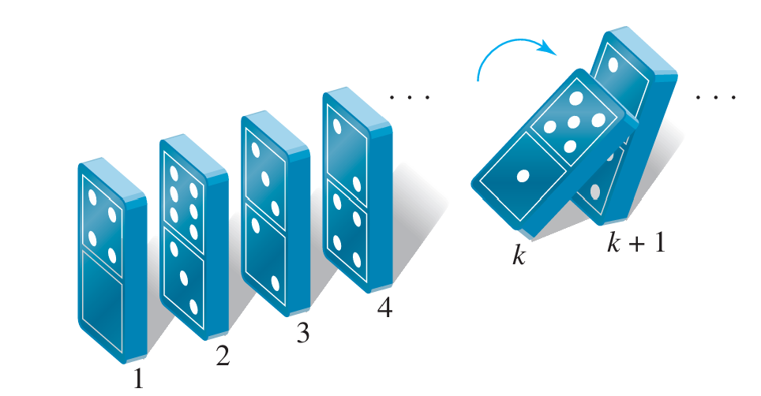
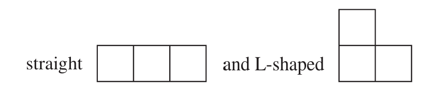
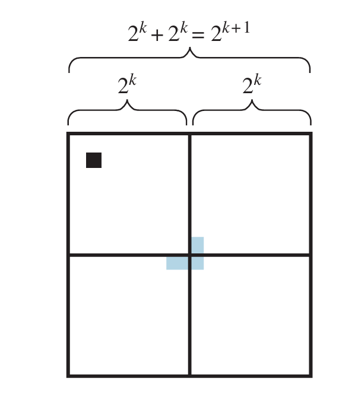

# 数学归纳法

**演绎(deduction)**是指使用逻辑推理法则从一般原理推断出结论,**归纳**则是指在观察到某一规律在大量具体实例中均成立后，总结出一个一般性原则.

!!! note ""
    **数学归纳法**是一种演绎而不是归纳,它实际上是一种**基于自然数良序性质**的演绎推理，不依赖于经验观察，而是通过“基本步+归纳步”的逻辑链条证明所有自然数都满足命题

假设$P(n)$是一个关于整数$n$的命题,而$a$是一个固定的整数,**数学归纳法原理(The principle of mathematical induction)**指的是,如果满足以下两个条件

1.   $P(a)$为真
2.   对于任意整数$k\ge a$,如果$P(k)$为真,那么$P(k+1)$也为真

那么对于任意的整数$n\ge a$,$P(n)$为真.

数学归纳法可用于证明形如“对于任意的$n\ge a$的整数,$P(n)$为真”的命题.在使用数学归纳法时,需要完成以下两个步骤

1.   **基本步骤(basis step)**:说明$P(a)$为真
2.   **归纳步骤(inductive step)**:说明对于任意整数$k\ge a$,如果$P(k)$为真,那么$P(k+1)$也为真

>   在进行归纳步骤时,首先假设$P(k)$为真(这个假设被称为**推理假设(inductive hypothesis)**),然后利用推理假设推导出$P(k+1)$.一般就是将$P(k+1)$往$P(k)$的形式上凑.

??? info "数学归纳法的直观理解"
    数学归纳法可以用多米诺骨牌倒下的过程来形象地表示.基本步骤就像是推倒了第$a$张骨牌,而归纳步骤就像是说明每一张骨牌倒下都会推倒下一张骨牌.因此,如果基本步骤和归纳步骤都成立,那么所有的骨牌都会被推倒.
    <figure markdown="span">
    { height="100" }
    <figcaption>数学归纳法可以用多米诺骨牌倒下的过程来形象地表示</figcaption>
    </figure>

下面来看几个利用数学归纳法进行证明的例子

!!!example "数学归纳法证明的例子"
    === "前$n$项整数的和"
        使用数学归纳法证明
$$
        1+2+\cdots+n=\frac{n(n+1)}{2}, n\ge1
$$

        本题要证明的命题$P(n)$是$1+2+\cdots+n=\dfrac{n(n+1)}{2}, n\ge1$.
    
        对于基本步骤, 需要证明$P(1)$为真,将$P(n)$中的$n$替换为$1$,得到
        $$
        1=\frac{1\cdot(1+1)}{2}=1
        $$
        显然,$P(1)$为真.   
        接着,来看归纳步骤.假设$P(k), k\ge1$为真,即
        $$
        1+2+\cdots+k=\frac{k(k+1)}{2}
        $$
        需要证明$P(k+1)$为真,即$1+2+\cdots+(k+1)=\dfrac{(k+1)(k+2)}{2}$为真.
        $$
        \begin{aligned}
        1+2+\cdots+k+(k+1)&=\frac{k(k+1)}{2}+(k+1) \\\\
        &=\frac{k(k+1)+2(k+1)}{2} \\\\
        &=\frac{(k+1)(k+2)}{2}
        \end{aligned}
        $$    
        所以$P(k+1)$为真.$\blacksquare$
    
    === "证明整除性"
        使用数学归纳法证明$2^{2n}-1, n\ge0$可以被$3$整除
        
        本题要证明的命题$P(n)$是$3\mid 2^{2n}-1, n\ge0$.
        对于基本步骤, 需要证明$P(0)$为真,将$P(n)$中的$n$替换为$0$,得到
        $$
        2^0-1=0=0\cdot3
        $$
        根据整除性的定义,$P(0)$为真.
        接着,来看归纳步骤.假设$P(k), k\ge0$为真,即
        $$
        2^{2k}-1\text{可以被}3\text{整除}
        $$
        根据整除性的定义,令$2^{2k}-1=3r$,$r$为整数.
        我们需要证明$P(k+1)$为真,即$2^{2(k+1)}-1$可以被$3$整除.
        $$
        \begin{aligned}
        2^{2(k+1)}-1&=2^{2k}\cdot2^2-1 \\\\
        &=2^{2k}(3+1)-1 \\\\
        &=3\cdot2^{2k}+2^{2k}-1 \\\\
        &=3\cdot2^{2k}+3r \\\\
        &=3(2^{2k}+r)
        \end{aligned}
        $$
        因为$2^{2k}+r$是整数,所以$2^{2(k+1)}-1$可以被$3$整除.
        所以$P(k+1)$为真.$\blacksquare$
    
    === "证明不等式"
        使用数学归纳法证明对任意大于等于$3$的整数$n$, 
        $$
        2n+1<2^n
        $$
        
        本题要证明的命题$P(n)$是$2n+1<2^n,n\ge3$.
        对于基本步骤, 需要证明$P(3)$为真,将$P(n)$中的$n$替换为$3$,得到
        $$
        2\cdot3+1=7<2^3=8
        $$
        显然,$P(3)$为真.
        接着,来看归纳步骤.假设$P(k), k\ge3$为真,即
        $$
        2k+1<2^k
        $$
        我们需要证明$P(k+1)$为真,即$2(k+1)+1<2^{k+1}$.
        $$
        \begin{aligned}
        2(k+1)+1&=(2k+1)+2 \\\\
        &<2^k+2 \\\\
        &<2^k+2^k \\\\
        &<2^{k+1}
        \end{aligned}
        $$
        所以$P(k+1)$为真.$\blacksquare$
    
    === "Trominoes问题"
        Trominoes是由三个正方形组成的图形,包括两种类型,如下图所示
        <figure markdown="span">
        { height="100" }
        <figcaption>Trominoes的两种类型</figcaption>
        </figure>
        使用数学归纳法证明对于任意的$n\ge1$,一个$2^n\times2^n$的棋盘,如果去掉其中的一个正方形,那么剩下的部分可以被L型的Trominoes覆盖.
    
        本题要证明的命题$P(n)$是对于任意的$n\ge1$,一个$2^n\times2^n$的棋盘,如果去掉其中的一个正方形,那么剩下的部分可以被L型的Trominoes覆盖.
    
        对于基本步骤, 需要证明$P(1)$为真,将$P(n)$中的$n$替换为$1$,得到一个$2\times2$的棋盘,如果去掉其中的一个正方形,那么剩下的部分可以被L型的Trominoes覆盖.
        如左图所示
    
        显然,$P(1)$为真.
    
        接着,来看归纳步骤.假设$P(k), k\ge1$为真,即对于任意的$k\ge1$,一个$2^k\times2^k$的棋盘,如果去掉其中的一个正方形,那么剩下的部分可以被L型的Trominoes覆盖.
        我们需要证明$P(k+1)$为真,即对于任意的$k+1\ge1$,一个$2^{k+1}\times2^{k+1}$的棋盘,如果去掉其中的一个正方形,那么剩下的部分可以被L型的Trominoes覆盖.
    
        将一个$2^{k+1}\times2^{k+1}$的棋盘分成四个$2^k\times2^k$的子棋盘,去掉的那个正方形必然在其中的一个子棋盘中,根据归纳假设,这个子棋盘剩下的部分可以被L型的Trominoes覆盖.
    
        将其他三部分的缺口拼成一个L型的Trominoes,覆盖在四个子棋盘的交界处,如右图所示
    
        所以$P(k+1)$为真.$\blacksquare$
    
        <figure markdown="span">
        {width="200" align=left}
        {width="200" align=right}
        </figure>

