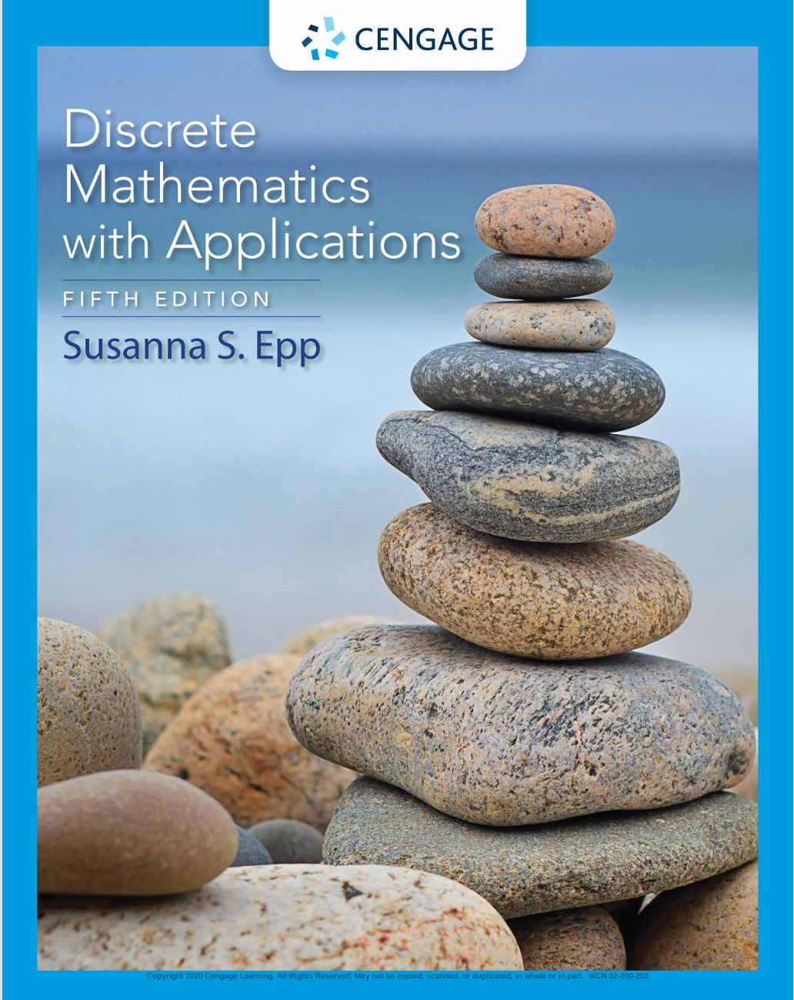

离散数学是计算机科学的基础,它研究离散对象的结构和性质.离散对象是指那些可以被分割成独立的、不可分割的部分的对象,例如整数、图、集合等.

我使用的教材是Epp的*Discrete Mathematics With Its Applications*

<figure markdown="span">
  { width="600" ,height="400" }
  <figcaption></figcaption>
</figure>