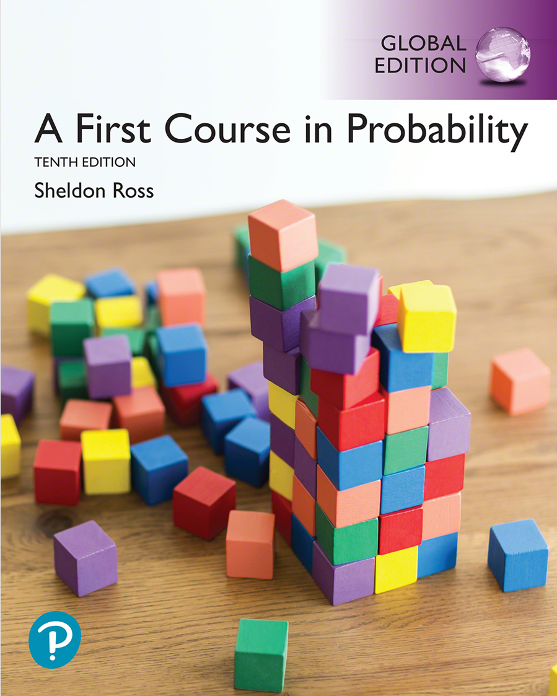

我使用的教材是Sheldon Ross的*A First Course in Probability 10th Edition*

<figure markdown="span">
  { width="300" }
  <figcaption></figcaption>
</figure>

!!! note "目录"
    - [x] [Chapter 1: Combinational Analysis](1.md)
    - [x] [Chapter 2: Axioms of Probability](2.md)
    - [ ] [Chapter 3: Combinational Probability and Independence]()
    - [ ] [Chapter 4: Random Variables]()
    - [ ] [Chapter 5: Continuous Random Variables]()
    - [ ] [Chapter 6: Jointly Distributed Random Variables]()
    - [ ] [Chapter 7: Probability Expectation]()
    - [ ] [Chapter 8: Limit Theorems]()
    - [ ] [Chapter 9: Additional Topics in Probability]()
    - [ ] [Chapter 10: Simulation]()

