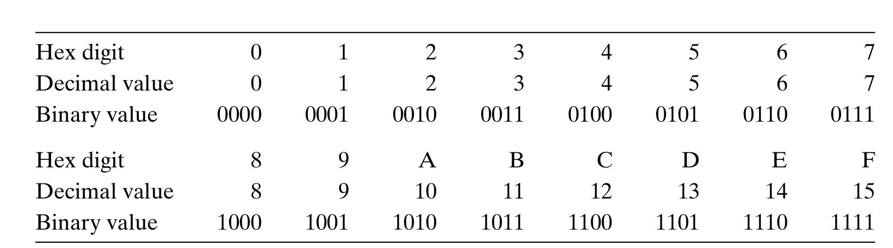
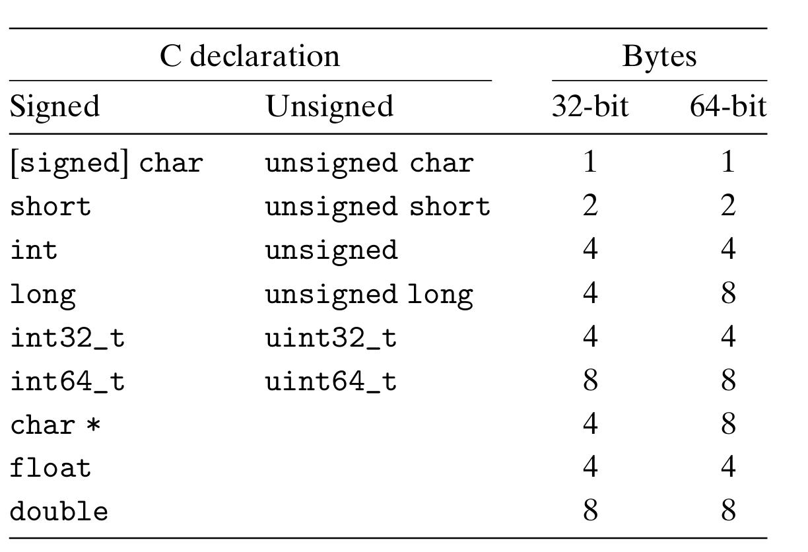
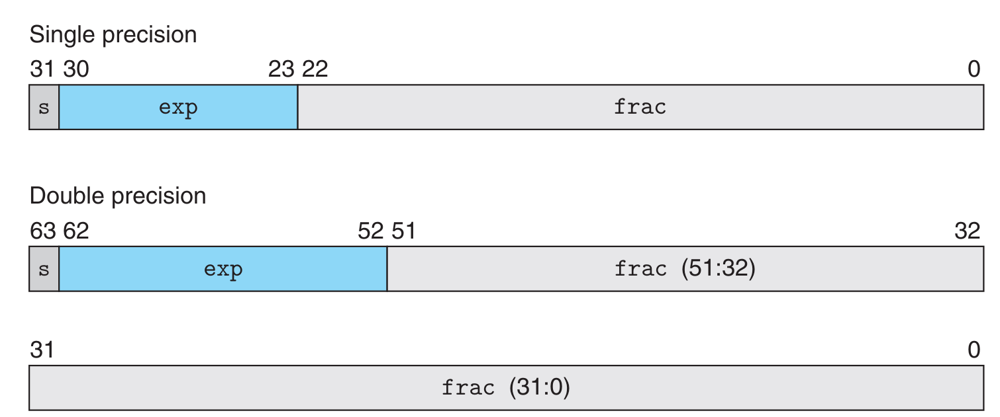
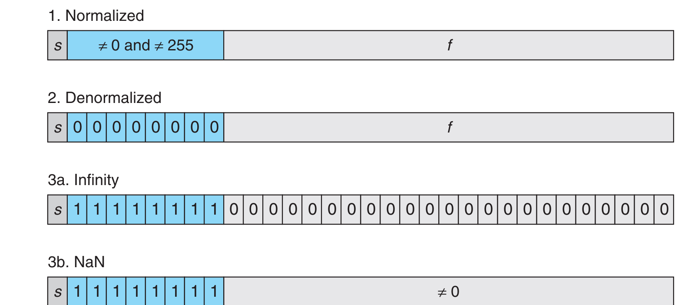

# 信息存储与表示

## 信息存储


### 十六进制表示法


十进制和十六进制表示之间的转换需要使用乘法或者除法来处理.一般情况,将一个十进制数字$x$转换为十六进制，可以反复地用$16$除$x$,得到一个商$q$和一个余数$r$,也就是$x=q\times16+r$.然后，我们用十六进制数字表示的$r$作为最低位数字,并且通过对$q$反复进行这个过程得到剩下的数字。

例如,考虑十进制$314156$的转换:

$$
\begin{aligned}
314156 & = 19635 \times 16 + 12 &\qquad (C)\\
19635 & = 1227 \times 16 + 3 &\qquad (2)\\
1227 & = 76 \times 16 + 11 &\qquad(B) \\
76 & = 4 \times 16 + 12 &\qquad (C)\\
4 & = 0 \times 16 + 4 &\qquad (4)
\end{aligned}   
$$

所以,十进制数$314156$的十六进制表示为$\mathrm{0x4CB2C}$.

同样的,将一个十六进制数字转换为十进制数字，我们可以用相应的$16$的幂乘以每个十六进制数字。

例如:将十六进制数$\mathrm{0x7AF}$转换为十进制:

$$
7\times 16^2 + 10 \times 16^1 + 15 \times 16^0 = 7 \times 256 + 10 \times 16 + 15 \times 1 = 1967
$$

### 字数据的大小
!!!tip "寻址范围"
    对于字长为$w$的计算机,它的寻址范围为$0\sim 2^w-1$,程序可以访问$2^w$字节.
    32位字长限制虚拟地址空间为4千兆字节(写作4GB),扩展到 64 位字长使得虚拟地址空间为16EB, 大约是$1.84\times10^{19}$字节。


下图为 `C语言` 中的数据类型的大小,其中` int `和` long `的大小与编译器有关,通常在32位系统中为4字节,在64位系统中为8字节.



### 寻址和字节顺序

一个$w$位整数的位表示为:$[x_{w-1},x_{w-2},\cdots,x_1,x_0]$,其中$x_{w-1}$为最高有效位,$x_0$为最低有效位.
最低有效位在前的表示方式为**小端法**,最高有效位在前的表示方法为**大端法**.
例如,对于数`0x01234567`,大端法和小端法的表示如下图


## C语言中的位级运算


## 整数表示

### 无符号数的编码

可以将一个$w$位的整数表示为向量$\vec{x}=[x_{w-1},x_{w-2},\cdots,x_1,x_0]$,对于$\vec{x}$有

$$
B2U_w(\vec{x})\doteq\sum^{w-1}_{i=0}x_i2^{i}
$$

$B2U_2$是一个双射

???+example "一些例子"

    $$
    \begin{aligned}
    B2U_4([0001])&=0\cdot 2^3+0\cdot 2^2+0\cdot 2^1+1\cdot 2^0=1\\
    B2U_4([1011])&=1\cdot 2^3+0\cdot 2^2+1\cdot 2^1+1\cdot 2^0=11\\
    B2U_4([1111])&=1\cdot 2^3+1\cdot 2^2+1\cdot 2^1+1\cdot 2^0=15\\
    \end{aligned}
    $$

$UMax_w=2^{w-1}$

## 补码编码
可以将一个$w$位的整数表示为向量$\vec{x}=[x_{w-1},x_{w-2},\cdots,x_1,x_0]$,对于$\vec{x}$有

$$
B2T_w(\vec{x})\doteq -x_{w-1}\cdot2^{w-1}+ \sum^{w-2}_{i=0}x_i2^{i}
$$

$B2T_2$是一个双射

???+example "一些例子"

    $$
    \begin{aligned}
    B2T_4([0001])&=-0\cdot 2^3+0\cdot 2^2+0\cdot 2^1+1\cdot 2^0=1\\
    B2T_4([1011])&=-1\cdot 2^3+0\cdot 2^2+1\cdot 2^1+1\cdot 2^0=-5\\
    B2T_4([1111])&=-1\cdot 2^3+1\cdot 2^2+1\cdot 2^1+1\cdot 2^0=-1\\
    \end{aligned}
    $$

## 有符号数和无符号数的转换

## 整数运算

### 无符号加法

对于满足$0\le x,y\le 2^w$的$x$和$y$有

$$
x+^u_w y=
\begin{cases}
x+y,x+y< 2^w\\
x+y-2^w,x+y>2^w
\end{cases}
$$

!!!info "检测无符号加法的溢出"
    对于满足$0\le x,y\le 2^w$的$x$和$y$,如果$x+y< x$或者$x+y< y$,则溢出.


## 补码加法
对于满足$TMin_w \le x,y \le TMax_w$的$x$和$y$有

$$
x+^t_w y=
\begin{cases}
x+y-2^w,&x+y\ge2^{w-1}\qquad\qquad&\text{正溢出}\\
x+y,&-2^{w-1}\le x+y< 2^{w-1}\\
x+y+2^w,&x+y< -2^{w-1}\qquad\qquad&\text{负溢出}
\end{cases}
$$


!!!info "检测补码加法的溢出"
    对于满足$TMin_w \le x,y \le TMax_w$的$x$和$y$,如果$x< 0,y< 0$且$x+y>0$则负溢出;如果$x>0,y>0$且$x+y< 0$,则正溢出.


## 补码的非

对于满足$TMin_w \le x\le TMax_w$的$x$有

$$
-^t_w x =
\begin{cases}
TMin_w, &x=TMax_w\\
-x,&x>TMin_w
\end{cases}
$$

> **补码的非的位级表示**
>
> 方法1: 将$x$的每一位取反,然后加1.
> 即-x与~x+1的值是相同的.
>
> 方法2: 假设$x$的位级表示为
> 
> $$
> [x_{w-1},x_{w-2},\cdots,x_{k+1},1,0,\cdots,0]
> $$
> 
> 其中,$k$为最右边的一个$1$,只要$x\ne0$,就一定存在这样的$k$.
>
> 那么$-^t_w x$的位级表示为
> 
> $$
> [\verb|~|x_{w-1},\verb|~|x_{w-2},\cdots,\verb|~|x_{k+1},1,0,\cdots,0]
> $$

!!!note "补码减法溢出判断"
    1. 如果$x>0, y<0$且$x-y<0$,则正溢出
    2. 如果$x<0, y>0$且$x-y>0$,则负溢出

## 无符号乘法
对于满足$0\le x,y\le UMax_w$的$x$和$y$有
$$
x *^u_w y=(x\cdot y)\bmod 2^w
$$

## 补码乘法
对于满足$TMin_w \le x,y \le TMax_w$的$x$和$y$有
$$
x*^t_w y=U2T_w((x\cdot y)\bmod 2^w)
$$

## 乘以常数
**乘以$2$的幂**

设无符号整数$x$的位级表示为$[x_{w-1},x_{w-2},\cdots,x_0]$,那么,对于任意的$k\ge0$,
向$x$的右侧加$k$个$0$得到$[x_{w-1},x_{w-2},\cdots,x_0,\cdots,0]$这是$x2^k$的位级表示

**与$2$的幂相乘的无符号乘法**

对于无符号整数$x$和$k$,其中$0\le k< w$,C表达式`x<<k`会得到$x*^u_w2^k$

**与$2$的幂相乘的补码乘法**

对于补码$x$和无符号整数$k$,其中$0\le k< w$,C表达式`x<<k`会得到$x*^u_w2^k$

对于一组$0$和$1$交替的序列
$$
[(0\cdots 0)(1\cdots 1)\cdots(0\cdots 0)(1\cdots 1)]
$$
对于一组从位位置$n$到位位置$m$的连续的$l$($n\le m$).可以用下面两种不同形式中的一种来计算这些位对乘积的影响

$$
\begin{aligned}
&\text{形式A}:(x<<n)+(x<<(n-1))+\cdots+(x<<m)\\
&\text{形式B}:(x<<(n+1))-(x<<m)
\end{aligned}
$$

## 除以2的幂

## 浮点数

### 二进制小数

与十进制小数类似,考虑一个形如

$$
b_mb_{m-1}\cdots b_1b_0.b_{-1}b_{-2}\cdots b_{-n-1}b_{-n}
$$

的二进制小数,其中每个$b_i$都是$0$或$1$.那么这个二进制小数的值为

$$
b=\sum^m_{i=-n}2^i\times b_i
$$

例如,二进制数$101.11_2$表示数字$1\times 2^2+0\times 2^1+1\times 2^0+1\times 2^{-1}+1\times 2^{-2}=5\dfrac{3}{4}$

### IEEE浮点数
IEEE浮点标准用 $V=(-1)^s\times M\times 2^E$ 来表示浮点数:

- 符号 $s$ 是符号位,决定了数的正负
- 尾数 $M$ 一个二进制数字,范围是 $1\sim 2-\epsilon$,或者 $0\sim 1-\epsilon$ .
- 指数 $E$ 是对浮点数加权

将浮点数划分为三个部分,分别进行编码

- 一个单独的符号位 $s$直接编码符号$s$。
- $k$ 位的阶码字段 $exp=e_{k-1} \cdots e_1 e_0$。编码阶码 $E$。
- $n$ 位小数字段 $frac=f_{n-1} \cdots f_1 f_0$编码尾数 $M$, 但是编码出来的值也依赖于阶码字段的值是否等于0



给定位表示,根据`exp`的值，被编码的值可以分成三种不同的情况(最后一种情况有两个变种)



## 补充1:掩码
### 提取特定的位

要提取一个数中特定的位应使用`&`,将要提取的位对应的mask设置为$1$,其余的设置为$0$.
例如
```c
int x = 0xABCD;         // 二进制：1010101111001101
int mask = 0xF;         //  0xF = 0000000000001111
int result = x & mask   //  结果是0xD = 0000000000001101
```

以上代码会提取$x$的低$4$位

### 设置某些位为1

要设置特定的位为$1$应使用`|`,将要设置为$1$的位对应的mask设位$1$,其余位为$0$
例如
```c
int x = 0xA8;           // 二进制:0000000010101000
int mask = 0x3          // 0x3 = 0000000000000011
int result = x | mask;  // 结果是 0000000010101011
```

以上代码会将$x$的低$2$位设置为$1$.

### 清除某些位(设置为$0$)

要清除特定的位为应使用`&`,将要清除的位对应的mask设位$0$,其余位为$1$
构造mask时,可以使用`~`和`<<`
如果要将第$m$位和第$n$位设置为0,则mask应为`(1<<m)|(1<<n)`

例如
```c
int x = 0xA8;           // 二进制:0000000010101000
int mask = ~(0xF)       // ~(0xF) = 111111110000
int result = x & mask;  // 结果是 0000000010100000
```

### 取反某些位

要清除特定的位为应使用`^`(异或),将要取反的位对应的mask设位$1$,其余位为$0$
例如
```c
int x = 0xA8;           // 二进制:0000000010101000
int mask = 0x7;         // 0x7 = 0000000000000111
int result = x ^ mask;  //结果是 000000010101111
```

以上代码会将$x$的低$3$位取反.

### 判断某些位是否为$1$

要判断一个数中特定的位应使用`&`,将要判断的位对应的mask设置为$1$,其余的设置为$0$.
如果要判断的为全部为$1$,那么结果将等于mask,即可以用`x & mask == mask`进行判断
构造mask时,可以使用`~`和`<<`
如果要将第$m$位和第$n$位设置为0,则mask应为`(1<<m)|(1<<n)`

例如:
```c
int data = 0x8 // 00001000
int mask = (1 << 0) | (1 << 3); // 00001001
if (data & mask) 
{ 
	// 第0位或第3位至少有一位是1 
}
```

# 补充2:逻辑非(`!`)与逻辑双非(`!!`)

逻辑非与逻辑双非可以格式化结果.
如果$p$为$0$,则`!p`为1,`!!p`为0;
如果$p$非$0$,则`!p`为0,`!!p`为1.
